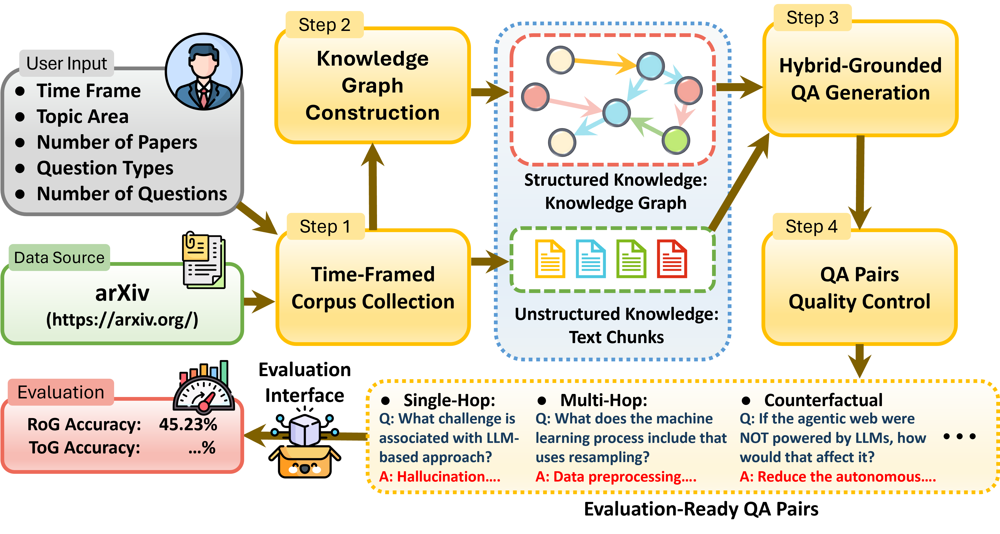

<div align="center">
  
</div>

<div align="center">

# [How Much Reasoning Do Retrieval-Augmented Models Add beyond LLMs?<br>A Benchmarking Framework for Multi-Hop Inference over Hybrid Knowledge](https://www.arxiv.org/abs/2602.10210)
[](https://www.arxiv.org/abs/2602.10210)
[](https://junhongmit.github.io/HybridRAG-Bench/)
[](https://huggingface.co/datasets/junhongmit/HybridRAG-Bench)
[](https://github.com/junhongmit/HybridRAG-Bench/blob/main/LICENSE)

<strong>Junhong Lin¹</strong>, <strong>Bing Zhang²</strong>, <strong>Song Wang³</strong>, <strong>Ziyan Liu</strong>, <strong>Dan Gutfreund²</strong>, <strong>Julian Shun¹</strong>, <strong>Yada Zhu²</strong> <br>
  ¹ MIT CSAIL, ² IBM Research, ³ University of Central Florida

</div>

--------------------------------------------------------------------------------

HybridRAG-Bench is a benchmark construction and evaluation framework for studying retrieval-intensive, multi-hop reasoning in large language models (LLMs). It is designed to diagnose how retrieval-augmented methods actually use external knowledge rather than relying on parametric memorization.

The framework automatically constructs hybrid knowledge environments consisting of unstructured text (scientific documents), and structured knowledge graphs (KGs) extracted from the same corpus, and generates diverse, reasoning-grounded question–answer pairs.

This repository provides a fully reproducible implementation of the benchmark pipeline and evaluation used in the HybridRAG-Bench paper.



## 📌 Overview

HybridRAG-Bench follows a four-stage pipeline:
1. Time-framed corpus collection
Scientific documents are collected from arXiv based on user-specified domains and time ranges, ensuring that benchmark knowledge is recent and external to LLM pretraining.
2. Hybrid knowledge construction
From the corpus, the framework extracts aligned text chunks, and contextualized entities and relations, forming a unified hybrid knowledge environment that supports both document retrieval and graph traversal.
3. Reasoning-grounded QA generation
Question-answer pairs are generated from explicit reasoning paths in the knowledge graph, covering single-hop, conditional, multi-hop, hard multi-hop, counterfactual, and open-ended reasoning.
4. Automated quality control
All questions are validated using LLM-as-a-Judge to ensure answerability, quality, deduplication, and normalization.

The resulting benchmark disentangles retrieval quality from reasoning capability and exposes failure modes that are invisible to traditional QA benchmarks.

## 🤗 Using the Hugging Face Dataset

The public release in this repository focuses on arXiv papers only. The benchmark ships three domains:
- `arxiv_ai`
- `arxiv_cy`
- `arxiv_qm`

Each domain provides:
- unstructured paper text for document retrieval
- a paired knowledge graph imported into Neo4j
- reasoning-grounded QA pairs generated from the same corpus

If you use the published dataset at `junhongmit/HybridRAG-Bench`, do not call `load_dataset("junhongmit/HybridRAG-Bench")` as a single dataset object. The repo contains multiple parquet tables with different schemas and is intended to be downloaded as a folder snapshot.

Recommended flow:

1. Download the dataset repo snapshot:
```bash
huggingface-cli download junhongmit/HybridRAG-Bench \
  --repo-type dataset \
  --local-dir /path/to/HybridRAG-Bench-dataset
```
2. Reconstruct the text/QA data under your local `DATASET_PATH` (see how it defined in the environment setup below):
```bash
python arxiv_fetcher/import_hf_text_qa.py \
  --text-qa-root /path/to/HybridRAG-Bench-dataset/release/text_qa \
  --out-data-root /path/to/DATASET_PATH \
  --domains arxiv_ai arxiv_qm arxiv_cy \
  --overwrite
```
3. Import the released KG into Neo4j:
```bash
python kg/import_hf_kg.py \
  --uri bolt://localhost:7687 \
  --user neo4j \
  --password password \
  --kg-root /path/to/HybridRAG-Bench-dataset/release/kg \
  --databases arxiv.ai arxiv.qm arxiv.cy \
  --clear-db \
  --apply-schema
```

## ⚙️ Environment Setup

We recommend using `vllm`, which automatically installs most dependencies. Additional dependencies are listed in [`requirements.txt`](requirements.txt).

```bash
conda create -n vllm python=3.12 -y
conda activate vllm
pip install vllm
pip install -r requirements.txt
```

After this, fill in the local environment variables. They are automatically loaded from a `.env` file. Copy `.env_template` to `.env` and update the settings.

Notes:
- `API_BASE` usually ends with `/v1`, for example `API_BASE="http://localhost:7878/v1"`.
- `API_KEY` is usually `DUMMY` unless you are using the OpenAI API directly.
> :bulb: **You can choose different environment config file at runtime by prepending an environment variable: `ENV_FILE=path/to/your/.env/file`. This is very useful to manage different LLM models and KG instances.**

## Set up Neo4j

The benchmark uses Neo4j for structured retrieval.

```bash
wget "https://neo4j.com/artifact.php?name=neo4j-community-5.26.3-unix.tar.gz" -O neo4j.tar.gz
tar -xvzf neo4j.tar.gz
mv neo4j-community-*/ neo4j/
cd neo4j
bin/neo4j-admin dbms set-initial-password password
```

### Install APOC

```bash
cp neo4j/labs/apoc-5.26.3-core.jar neo4j/plugins/apoc-5.26.3-core.jar
```

### Start and Stop Neo4j

```bash
cd neo4j
bin/neo4j start
bin/neo4j stop
bin/neo4j restart
```

### Optional: Access Neo4j Remotely

If Neo4j is running on a remote machine, create a tunnel:

```bash
ssh -L 7474:localhost:7474 -L 7687:localhost:7687 your_username@remote_cluster_address
```

Then open `http://localhost:7474/browser/` and log in with user `neo4j` and password `password`.

## Dataset Layout

The public benchmark is arXiv-only. Set `DATASET_PATH` in the `.env` file so it contains:

```text
DATASET_PATH/
  arxiv_AI/
  arxiv_CY/
  arxiv_QM/
```

Each domain directory contains the released paper corpus and QA files imported from the Hugging Face snapshot.

## Extending to Your Own Dataset

The released benchmark data is arXiv-only, but the framework itself is more general. At minimum, the current pipeline can process corpora stored as Markdown or plain-text files. If you can materialize your dataset as text documents, you can reuse the same KG construction, question generation, and QA evaluation pipeline.

The easiest extension path is:

1. Put your corpus under a new directory, for example:
```text
DATASET_PATH/
  my_dataset/
    docs/
      0001.txt
      0002.txt
    questions.json
```
2. Copy the template loader in [`dataset/template_text_dataset.py`](dataset/template_text_dataset.py).
3. Implement:
   - `load_doc()` to yield one text document at a time
   - `load_query()` if you also want to run QA evaluation on your own questions
4. Register your loader in the relevant runner, for example [`run/run_qa.py`](run/run_qa.py) or [`run/run_kg_update.py`](run/run_kg_update.py).

The document loader interface is simple. In `doc` mode, each yielded item should look like:

```python
{
    "id": "doc-1",
    "doc": "<full text content>",
    "created_at": None,
    "modified_at": None,
    "ref": "{\"id\": \"doc-1\", \"path\": \"/abs/path/to/doc-1.txt\"}"
}
```

In `qa` mode, each yielded item should look like:

```python
{
    "id": "0",
    "interaction_id": "0",
    "query": "Your question text",
    "query_time": None,
    "docs": [],
    "ans": "Ground-truth answer"
}
```

If your source files are not Markdown but are already plain text, no other special preprocessing is required at the loader level.

## KG Import and Update

Use:
- `arxiv_fetcher/import_hf_text_qa.py` to materialize paper text and QA files
- `kg/import_hf_kg.py` to import the released KG into Neo4j

If you are starting from a brand-new empty KG, first prime the Neo4j vector indexes with `run_kg_embed.py`. After that, use `run_kg_update.py` to build or extend the KG from the local arXiv corpus (or your own dataset):

```bash
python -m run.run_kg_embed
python -m run.run_kg_update --dataset arxiv_ai
python -m run.run_kg_update --dataset arxiv_cy
python -m run.run_kg_update --dataset arxiv_qm
python -m run.run_kg_update --dataset <name-of-your-dataset>
```

`run_kg_embed.py` is a one-time priming step for an empty KG. It creates the entity, relation, and schema vector indexes used by the KG-based baselines. It is not meant to be rerun after every update, because it recomputes embeddings for the entire KG.

## Indexing for RAG Baselines

Several reproduced RAG baselines build their own persistent indexes under `results/`. The workflow is:

1. Collect the corpus from the benchmark dataset.
2. Build the model-specific cache once.
3. Reuse that cache for QA runs.

This applies to:
- `hipporag`
- `lightrag`
- `graphrag`

Typical indexing commands:

```bash
python -m run.run_hipporag_index --dataset arxiv_ai
python -m run.run_lightrag_index --dataset arxiv_ai
python -m run.run_graphrag_index --dataset arxiv_ai
```

Then run QA against the built cache:

```bash
python -m run.run_qa --dataset arxiv_ai --model hipporag
python -m run.run_qa --dataset arxiv_ai --model lightrag
python -m run.run_qa --dataset arxiv_ai --model graphrag
```

Notes:
- Caches are model-specific and environment-specific. Different `ENV_FILE` values or model names will write to different cache directories.
- `LightRAG` and `GraphRAG` support rerunning indexing on the same cache directory.
- Use `--config force_index=True` only when you want to rebuild the cache from scratch.
- `LightRAG` resume reuses the existing queue rather than re-enqueuing the entire corpus.
- The wrappers expect local clones of the upstream projects at sibling paths `../HippoRAG`, `../LightRAG`, and `../graphrag` by default. Override these with `--config hipporag_repo_path=...`, `lightrag_repo_path=...`, or `graphrag_repo_path=...` if needed.

## Run Inference

Run QA on one of the released domains:

```bash
python -m run.run_qa --dataset arxiv_ai --model io
python -m run.run_qa --dataset arxiv_cy --model rag
python -m run.run_qa --dataset arxiv_qm --model tog
python -m run.run_qa --dataset arxiv_ai --model lightrag
python -m run.run_qa --dataset arxiv_ai --model graphrag
```

Results are written under `results/<dataset>/`.

## Run Evaluation

Evaluation runs automatically at the end of `run_qa.py`, but you can also re-evaluate saved outputs:

```bash
python -m run.run_eval --dataset arxiv_ai --model io
ENV_FILE=.env.eval python -m run.run_eval \
  --reeval results/arxiv_ai/io_arxiv_ai_results-0.json
```

## Question Generation

The released question-generation pipeline now writes both question files and aligned groundtruth evidence files.

Examples:

```bash
python -m run.run_question_gen --question-type all
python -m run.run_question_merge
```

Deduplication is already included in `run_question_gen.py`, so no separate dedup helper is required.

Supported generators are defined under `question_gen/` and include:
- `paper`
- `single_hop`
- `single_hop_w_condition`
- `multi_hop`
- `open_ended`
- `counterfactual`
- `counterfactual_cwqstyle`

## Known Issues

- **Q**: I am using macOS and `blingfire` complains about architecture mismatch.
- **A**: `blingfire` does not support Apple Silicon natively. Build it from source and replace the installed dylib.

```bash
git clone https://github.com/microsoft/BlingFire.git
cd BlingFire
mkdir Release
cd Release
cmake ..
make
```
